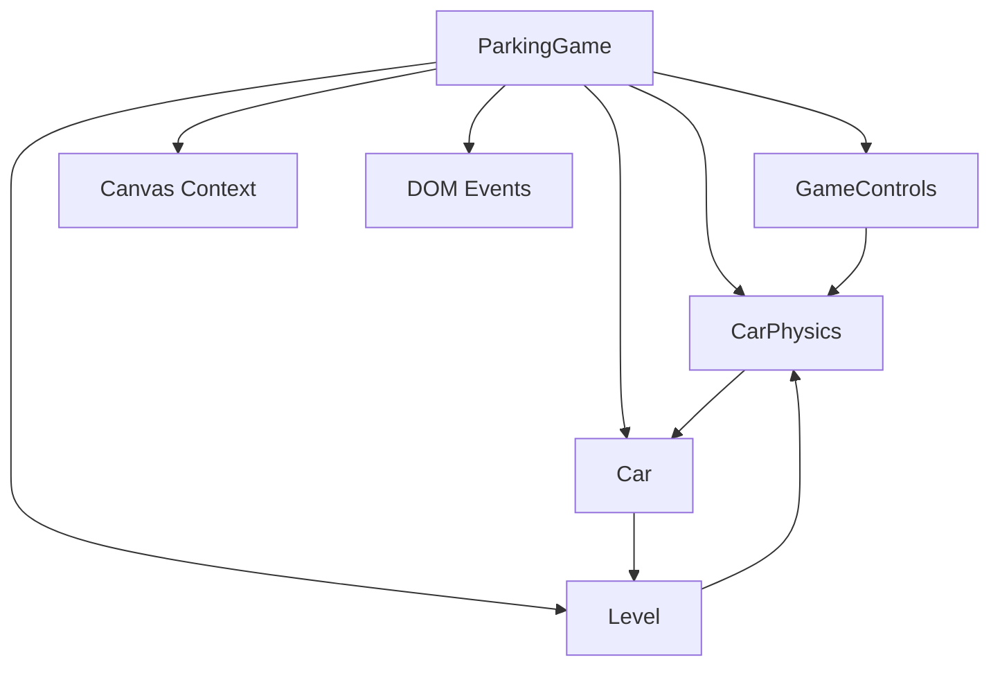

# System Architecture: Car Parking Game

## System Architecture
The game is a single-page browser application built with vanilla JavaScript, HTML5 Canvas for rendering, and CSS for styling. It follows a modular, object-oriented design where core functionality is separated into distinct classes and files. The architecture emphasizes simplicity, performance, and maintainability without external dependencies or build tools. The game runs entirely client-side, using requestAnimationFrame for the main loop to ensure smooth 60fps rendering.

## Source Code Paths
- `index.html`: Entry point - sets up DOM structure (UI, canvas, mobile controls) and loads JS modules in order.
- `css/style.css`: Responsive styling with glassmorphism effects, media queries for mobile.
- `js/game.js`: Main orchestrator - `ParkingGame` class handles initialization, game loop, state management, event listeners, and rendering.
- `js/physics.js`: Physics simulation - `CarPhysics` and `Car` classes manage movement, steering, collisions.
- `js/controls.js`: Input handling - `GameControls` class processes keyboard and touch events.
- `js/levels.js`: Level data and rendering - `Level` class defines boundaries, spots, and draws elements using SVG or fallbacks.
- `assets/*.svg`: Visual assets for car, obstacles, parking spot, exit, road - scalable vector graphics.

The project structure is flat: root contains index.html, css/ and js/ directories, and assets/. No server-side or backend components.

## Key Technical Decisions
- **Modular JS Loading:** Scripts loaded via <script> tags in specific order to ensure dependencies (e.g., game.js first, then physics.js, etc.).
- **Canvas Rendering:** 2D context for efficient drawing with transformations (translate, rotate) for car orientation.
- **Physics Model:** Bicycle model for steering (turn radius based on wheelbase and steering angle); AABB collision for simplicity and speed; no full physics engine to keep it lightweight.
- **Input Smoothing:** Gradual ramping of control states (0-1) for responsive yet precise handling.
- **State Management:** Simple finite state machine (FSM) with string states ('playing', 'parked', etc.) to control progression and UI updates.
- **Asset Fallbacks:** SVG images with canvas-drawn alternatives (rects, strokes) if loading fails.
- **Audio:** Procedural generation using Web Audio API oscillators for beeps/crashes - no file dependencies.
- **Device Detection:** User agent sniffing to toggle mobile controls; touch prevention on canvas to avoid scrolling.
- **Performance:** Delta-time based updates with 60fps fallback; collision checks only on boundaries (not every frame for all objects).

## Design Patterns in Use
- **Object-Oriented Programming (OOP):** Classes encapsulate concerns (e.g., `Car` for position/rendering, `Level` for data/rendering).
- **Modular Design:** Separation of concerns - each JS file focuses on one domain (controls, physics, etc.).
- **Finite State Machine (FSM):** Game states drive behavior (e.g., enable/disable checks based on 'parked' or 'exiting').
- **Event-Driven:** DOM events for inputs and UI interactions; no pub/sub but simple listeners.
- **Composition:** `ParkingGame` composes other classes (`CarPhysics`, `GameControls`, `Level`, `Car`) rather than inheritance.
- **Render Loop Pattern:** Update-then-render cycle using requestAnimationFrame.

## Component Relationships
The core classes interact as follows:

- `ParkingGame` initializes and coordinates all components.
- `GameControls` feeds input to `CarPhysics`.
- `CarPhysics` updates `Car` position/velocity using `Level` boundaries.
- `Level` provides data for collision checks and rendering.
- `Car` is updated by physics and rendered by `ParkingGame`.
- Rendering: `Level.render()` then `Car.render()` on canvas.
- Audio/UI: Handled directly in `ParkingGame`.

## Critical Implementation Paths
- **Initialization Path:** DOMContentLoaded -> new ParkingGame() -> loadLevel() -> create Level/Car -> setupEventListeners() -> detectDevice() -> start gameLoop().
- **Main Loop Path:** requestAnimationFrame -> update(deltaTime): controls.update() -> physics.update(car, controls, deltaTime, boundaries) -> checkCollisions() -> checkParkingSuccess()/checkExitSuccess() -> render(): clearCanvas() -> level.render() -> car.render() -> draw overlays.
- **Input Path:** keydown/touchstart -> set pressed flags -> update() ramps to 1.0 -> physics applies acceleration/steering.
- **Collision Path:** physics.update() -> for each boundary: checkCollision(AABB) -> if overlap: velocity=0, pushAway() based on min overlap axis.
- **State Transition Path:** checkParkingSuccess() -> if position & low speed: state='parked', playSound, timeout to 'exiting' -> checkExitSuccess() -> if position: state='completed', nextLevel().
- **Level Progression:** nextLevel() -> currentLevel++, if <=5: loadLevel() else show completion message.

This architecture supports easy extension (e.g., add new levels to Level class) while keeping the core loop efficient.